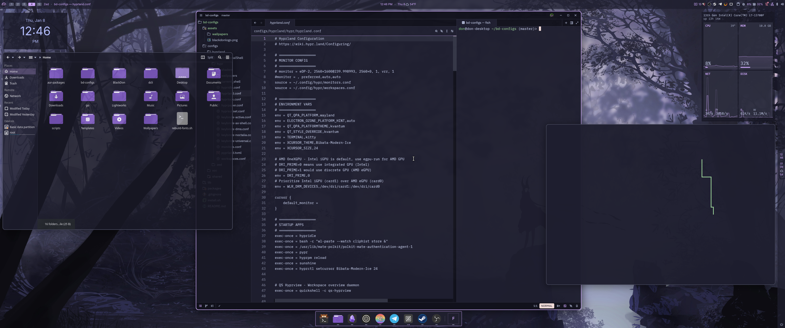

# donarch TheBlackDon's Dotfiles

> ⚠️ **Temporary Notice:** Hyprland configuration is currently unavailable while being updated. Only **Niri** is available for installation at this time. Hyprland support will return once the configuration update is complete.

**Don's Arch Configurations** for Niri with DankMaterialShell

A complete, ready-to-use desktop environment configuration for Arch Linux featuring modern Wayland compositors with Catppuccin Design aesthetics.


If you enjoy what I do, consider supporting me on Ko-fi! Every little bit means the world! https://ko-fi.com/theblackdon


## Features

- **Niri Compositor**: Scrollable-tiling Wayland compositor (Hyprland temporarily unavailable)
- **DankMaterialShell (DMS)**: Beautiful Material Design shell with bar, notifications, launcher, and lock screen
- **Catppuccin Mocha Theme**: Consistent theming across all applications (GTK, Qt, terminal, shell)
- **DMS-Greeter**: Elegant display manager for seamless session switching
- **Curated Applications**: kitty terminal, fish shell, nemo file manager, and optional apps
- **Symlinked Configs**: Easy to update - edit files in the repo and changes apply immediately
- **Optional dcli Integration**: Declarative package management for tracking your system configuration in YAML and git

## Screenshots


*DonArch running with Niri, DankMaterialShell, and Catppuccin Mocha theme*

## Requirements

- **OS**: Arch Linux or Arch-based distribution (CachyOS, EndeavourOS, etc.)
- **AUR Helper**: paru or yay
- **Internet Connection**: Required for package installation

## Installation

### Quick Install

```bash
git clone https://gitlab.com/theblackdon/donarch.git
cd donarch
./install.sh
```

The installer will guide you through:
1. System compatibility checks
2. Niri compositor installation
3. Optional application selection
4. dcli integration (optional)
5. Package installation
6. Configuration deployment
7. Theme application
8. Display manager setup

### What Gets Installed

**Core Packages:**
- Build tools (git, cmake, meson, gcc, base-devel)
- jq and dialog for the installer

**Compositor Packages:**
- Niri: niri, waybar, mako, fuzzel, swayidle, screenshot tools (Hyprland temporarily unavailable)

**Theme Packages:**
- Catppuccin GTK theme (Mocha variant)
- Tela purple icon theme
- Bibata Modern Ice cursor theme
- Qt5/Qt6 Wayland support and theming
- Kvantum theme engine

**DMS & Display Manager:**
- DankMaterialShell (dms-shell-git)
- Quickshell (DMS dependency)
- greetd + greetd-dms-greeter-git

**Required Applications:**
- kitty (terminal)
- fish (shell)
- nemo (file manager)
- fastfetch (system info)

**Optional Applications:**
- Zen Browser (privacy-focused browser)
- Zed (modern code editor)
- Helix (modal text editor)

## Post-Installation

### First Login

1. **Reboot your system**
2. **At the DMS-greeter login screen:**
   - Select the Niri session
   - Log in with your credentials
3. **Enjoy your beautiful desktop!**

### Key Bindings

#### Universal (Both Compositors)
- `Super + Space` - Application launcher
- `Super + T` or `Super + Return` - Terminal (kitty)
- `Super + Ctrl + Return` - Floating Terminal (kitty)
- `Super + Q` - Close window
- `Super + F` - File manager (nemo)
- `Super + B` - Browser (if installed)
- `Super + Shift + R` - Reload compositor config
- `Super + Alt + L` - Lock screen
- `Super + Ctrl + Up or Down` - Move relative workspaces

#### Media Keys
- `XF86AudioRaiseVolume` - Volume up
- `XF86AudioLowerVolume` - Volume down
- `XF86AudioMute` - Toggle mute
- `XF86MonBrightnessUp` - Brightness up
- `XF86MonBrightnessDown` - Brightness down


## dcli Integration (Optional)

DonArch supports optional integration with **dcli** - a declarative package management tool for Arch Linux inspired by NixOS.

### What is dcli?

dcli allows you to:
- Manage all your packages in YAML configuration files
- Track your entire system configuration in git
- Sync your setup across multiple machines
- Organize packages into reusable modules
- Declaratively manage systemd services

### What happens when you enable dcli?

If you choose to install dcli during setup, the installer will:
1. Install `dcli-arch-git` from AUR
2. Create a dcli configuration structure at `~/.config/arch-config`
3. Generate modules for all DonArch packages:
   - `base` - Core dependencies
   - `themes` - Catppuccin Mocha theme packages
   - `dms` - DankMaterialShell packages
   - `apps` - Terminal, file manager, shell
    - `niri` - Niri compositor
4. Create a host configuration file with all installed packages declared

### Using dcli after installation

```bash
# View your current configuration
dcli status

# Sync packages (install missing, optionally remove extras)
dcli sync

# List all modules
dcli module list

# Enable/disable modules
dcli module enable gaming
dcli module disable development

# Search and install packages
dcli search
dcli install firefox

# Set up git tracking (recommended for multi-machine setups)
dcli repo init

# Edit configurations
dcli edit
```

### Multi-machine setup with dcli

```bash
# On your first machine
dcli repo init              # Initialize git repository
dcli repo push              # Push to your git remote

# On additional machines
dcli repo clone             # Clone your configuration
dcli sync                   # Install all packages from config
```

For more information, visit the [dcli repository](https://gitlab.com/theblackdon/dcli-arch).

## Customization

All configuration files are symlinked from the repository, making customization easy:

```bash
cd donarch

# Edit Niri config
nano configs/niri/niri/config.kdl

# Edit terminal config
nano configs/shared/kitty/kitty.conf

# Edit shell config
nano configs/shared/fish/config.fish

# Edit DMS settings
nano configs/shared/DankMaterialShell/settings.json
```

Changes take effect immediately (or after reloading the compositor with `Super+Shift+R`).

### Changing Wallpapers

Replace the wallpaper at:
```bash
assets/wallpapers/wallpaper.png
```

Or edit the compositor config to point to your own wallpaper.

## Troubleshooting

### DMS-greeter doesn't start
```bash
# Check greetd status
sudo systemctl status greetd

# Check greetd config
cat /etc/greetd/config.toml

# Restart greetd
sudo systemctl restart greetd
```

### Themes not applying
```bash
# Reapply themes manually
gsettings set org.gnome.desktop.interface gtk-theme 'catppuccin-mocha-mauve-standard+default'
gsettings set org.gnome.desktop.interface icon-theme 'Tela-purple-dark'
gsettings set org.gnome.desktop.interface cursor-theme 'Bibata-Modern-Ice'
```

### DMS shell not starting
```bash
# Check if DMS is running
pgrep -a dms

# Start DMS manually
dms run
```

### Compositor won't start
```bash
# For Niri
niri-session

# Check logs
journalctl --user -xe
```

## Uninstallation

To remove donarch and restore your system:

```bash
# Stop and disable greetd
sudo systemctl disable --now greetd

# Restore original configs (if you made a backup)
rm -rf ~/.config
mv ~/.config.backup-YYYYMMDD_HHMMSS ~/.config

# Remove symlinks
unlink ~/.config/niri
unlink ~/.config/DankMaterialShell
# ... etc

# Optionally remove packages
sudo pacman -R niri dms-shell-git greetd-dms-greeter-git
```

## Directory Structure

```
donarch/
├── install.sh              # Main installer script
├── README.md               # This file
├── lib/                    # Installer library functions
│   ├── utils.sh           # Utility functions
│   ├── checks.sh          # System checks
│   ├── packages.sh        # Package installation
│   ├── dotfiles.sh        # Config deployment
│   ├── themes.sh          # Theme application
│   └── greeter.sh         # Display manager setup
├── configs/               # Configuration files
│   ├── shared/            # Shared configurations
│   └── niri/              # Niri-specific
├── packages/              # Package lists
└── assets/                # Wallpapers and images
```

## Credits

- **[DankMaterialShell (DMS)](https://github.com/dburian/DankMaterialShell)** - Beautiful Material Design shell for Wayland
- **[Niri](https://github.com/YaLTeR/niri)** - Scrollable-tiling Wayland compositor
- **[Catppuccin](https://github.com/catppuccin/catppuccin)** - Soothing pastel theme
- **[greetd](https://git.sr.ht/~kennylevinsen/greetd)** - Minimal display manager

## License

MIT License - Feel free to use and modify as you wish!

## Contributing

Issues and pull requests welcome! If you find bugs or have suggestions for improvements, please open an issue on GitLab.

---

**Made with ❤️ by TheBlackDon**
